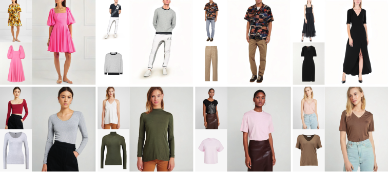

# LaDI-VTON (ACM Multimedia 2023)
### Latent Diffusion Textual-Inversion Enhanced Virtual Try-On
[**Davide Morelli**](https://scholar.google.com/citations?user=UJ4D3rYAAAAJ&hl=en)**\***,
[**Alberto Baldrati**](https://scholar.google.com/citations?hl=en&user=I1jaZecAAAAJ)**\***,
[**Giuseppe Cartella**](https://scholar.google.com/citations?hl=en&user=0sJ4VCcAAAAJ),
[**Marcella Cornia**](https://scholar.google.com/citations?hl=en&user=DzgmSJEAAAAJ),
[**Marco Bertini**](https://scholar.google.com/citations?user=SBm9ZpYAAAAJ&hl=en),
[**Rita Cucchiara**](https://scholar.google.com/citations?hl=en&user=OM3sZEoAAAAJ)

**\*** Equal contribution.

[](https://arxiv.org/abs/2305.13501)
[](https://github.com/miccunifi/ladi-vton)

This is the **official repository** for the [**paper**](https://arxiv.org/abs/2305.13501) "*LaDI-VTON: Latent Diffusion Textual-Inversion Enhanced Virtual Try-On*".

## Overview




>**Abstract**: <br>
> The rapidly evolving fields of e-commerce and metaverse continue to seek innovative approaches to enhance the consumer experience. At the same time, recent advancements in the development of diffusion models have enabled generative networks to create remarkably realistic images. In this context, image-based virtual try-on, which consists in generating a novel image of a target model wearing a given in-shop garment, has yet to capitalize on the potential of these powerful generative solutions. This work introduces LaDI-VTON, the first Latent Diffusion textual Inversion-enhanced model for the Virtual Try-ON task. The proposed architecture relies on a latent diffusion model extended with a novel additional autoencoder module that exploits learnable skip connections to enhance the generation process preserving the model's characteristics. To effectively maintain the texture and details of the in-shop garment, we propose a textual inversion component that can map the visual features of the garment to the CLIP token embedding space and thus generate a set of pseudo-word token embeddings capable of conditioning the generation process. Experimental results on Dress Code and VITON-HD datasets demonstrate that our approach outperforms the competitors by a consistent margin, achieving a significant milestone for the task


## Citation
If you make use of our work, please cite our paper:

```bibtex
@inproceedings{morelli2023ladi,
  title={{LaDI-VTON: Latent Diffusion Textual-Inversion Enhanced Virtual Try-On}},
  author={Morelli, Davide and Baldrati, Alberto and Cartella, Giuseppe and Cornia, Marcella and Bertini, Marco and Cucchiara, Rita},
  booktitle={Proceedings of the ACM International Conference on Multimedia},
  year={2023}
}
```

## Getting Started
We recommend using the [**Anaconda**](https://www.anaconda.com/) package manager to avoid dependency/reproducibility problems. 
For Linux systems, you can find a conda installation guide [here](https://docs.conda.io/projects/conda/en/latest/user-guide/install/linux.html).

### Installation

1. Clone the repository

```sh
git clone https://github.com/miccunifi/ladi-vton
```

2. Install Python dependencies

```sh
conda env create -n ladi-vton -f environment.yml
conda activate ladi-vton
```

Alternatively, you can create a new conda environment and install the required packages manually:

```sh
conda create -n ladi-vton -y python=3.10
conda activate ladi-vton
pip install torch==2.0.1 torchvision==0.15.2 opencv-python==4.7.0.72 diffusers==0.14.0 transformers==4.27.3 accelerate==0.18.0 clean-fid==0.1.35 torchmetrics[image]==0.11.4 wandb==0.14.0 matplotlib==3.7.1 tqdm xformers
```

### Data Preparation
#### DressCode
1. Download the [DressCode](https://github.com/aimagelab/dress-code) dataset
2. To enhance the performance of our warping module, we have discovered that using in-shop images with a white background 
yields better results. To facilitate this process, we now offer pre-extracted masks that can be used to remove the 
background from the images. You can download the masks from the following link: [here](https://github.com/miccunifi/ladi-vton/releases/download/weights/dresscode_masks.zip). Once downloaded, please 
extract the mask files and place them in the dataset folder alongside the corresponding images. 

Once the dataset is downloaded, the folder structure should look like this:
```
├── DressCode
|   ├── test_pairs_paired.txt
|   ├── test_pairs_unpaired.txt
|   ├── train_pairs.txt
│   ├── [dresses | lower_body | upper_body]
|   |   ├── test_pairs_paired.txt
|   |   ├── test_pairs_unpaired.txt
|   |   ├── train_pairs.txt
│   │   ├── images
│   │   │   ├── [013563_0.jpg | 013563_1.jpg | 013564_0.jpg | 013564_1.jpg | ...]
│   │   ├── masks
│   │   │   ├── [013563_1.png| 013564_1.png | ...]
│   │   ├── keypoints
│   │   │   ├── [013563_2.json | 013564_2.json | ...]
│   │   ├── label_maps
│   │   │   ├── [013563_4.png | 013564_4.png | ...]
│   │   ├── skeletons
│   │   │   ├── [013563_5.jpg | 013564_5.jpg | ...]
│   │   ├── dense
│   │   │   ├── [013563_5.png | 013563_5_uv.npz | 013564_5.png | 013564_5_uv.npz | ...]
```

#### VITON-HD
1. Download the [VITON-HD](https://github.com/shadow2496/VITON-HD) dataset

Once the dataset is downloaded, the folder structure should look like this:
```
├── VITON-HD
|   ├── test_pairs.txt
|   ├── train_pairs.txt
│   ├── [train | test]
|   |   ├── image
│   │   │   ├── [000006_00.jpg | 000008_00.jpg | ...]
│   │   ├── cloth
│   │   │   ├── [000006_00.jpg | 000008_00.jpg | ...]
│   │   ├── cloth-mask
│   │   │   ├── [000006_00.jpg | 000008_00.jpg | ...]
│   │   ├── image-parse-v3
│   │   │   ├── [000006_00.png | 000008_00.png | ...]
│   │   ├── openpose_img
│   │   │   ├── [000006_00_rendered.png | 000008_00_rendered.png | ...]
│   │   ├── openpose_json
│   │   │   ├── [000006_00_keypoints.json | 000008_00_keypoints.json | ...]
```


## Inference
To run the inference on the Dress Code or VITON-HD dataset, run the following command:
```sh
python src/inference.py --dataset [dresscode | vitonhd] --dresscode_dataroot <path> --vitonhd_dataroot <path> --output_dir <path> --test_order [paired | unpaired] --category [all | lower_body | upper_body | dresses ] --batch_size <int> --mixed_precision [no | fp16 | bf16] --enable_xformers_memory_efficient_attention <store_true> --num_workers <int>  --use_png <store_true> --compute_metrics <store_true>
```
```
    --dataset                      dataset to use (dresscode or vitonhd)
    --dresscode_dataroot           dataroot of dresscode dataset (required when dataset=dresscode)
    --vitonhd_dataroot             dataroot of vitonhd dataset (required when dataset=vitonhd)
    --test_order                   test setting (paired or unpaired)
    --category                     category to test (all, lower_body, upper_body, dresses) (default=all)
    --output_dir                   output directory
    --batch_size                   batch size (default=8)
    --mixed_precision              mixed precision (no, fp16, bf16) (default=no)
    --enable_xformers_memory_efficient_attention
                                   enable memory efficient attention in xformers (default=False)
    --num_workers                  number of workers (default=8)
    --use_png                      use png instead of jpg (default=False)
    --compute_metrics              compute metrics at the end of inference (default=False)
```
    

Since we release the pre-trained models via torch.hub, the models will be automatically downloaded when running the inference script.

### Metrics computation
Once you have run the inference script and extracted the images, you can compute the metrics by running the following command:
```sh
python src/utils/val_metrics.py --gen_folder <path> --dataset [dresscode | vitonhd] --dresscode_dataroot <path> --vitonhd_dataroot <path> --test_order [paired | unpaired] --category [all | lower_body | upper_body | dresses ] --batch_size <int> --workers <int>
```
```
    --gen_folder                   Path to the generated images folder.
    --dataset                      dataset to use (dresscode or vitonhd)
    --dresscode_dataroot           dataroot of dresscode dataset (required when dataset=dresscode)
    --vitonhd_dataroot             dataroot of vitonhd dataset (required when dataset=vitonhd)
    --test_order                   test setting (paired or unpaired)
    --category                     category to test (all, lower_body, upper_body, dresses) (default=all)
    --batch_size                   batch size (default=32)
    --workers                      number of workers (default=8)
```

## TODO
- [ ] Training Code


## Acknowledgements
This work has partially been supported by the PNRR project “Future Artificial Intelligence Research (FAIR)”, by the PRIN project “CREATIVE: CRoss-modal understanding and gEnerATIon of Visual and tExtual content” (CUP B87G22000460001), both co-funded by the Italian Ministry of University and Research, and by the European Commission under European Horizon 2020 Programme, grant number 101004545 - ReInHerit.


## LICENSE
<a rel="license" href="http://creativecommons.org/licenses/by-nc/4.0/"></a><br />All material is made available under [Creative Commons BY-NC 4.0](https://creativecommons.org/licenses/by-nc/4.0/). You can **use, redistribute, and adapt** the material for **non-commercial purposes**, as long as you give appropriate credit by **citing our paper** and **indicate any changes** that you've made.

